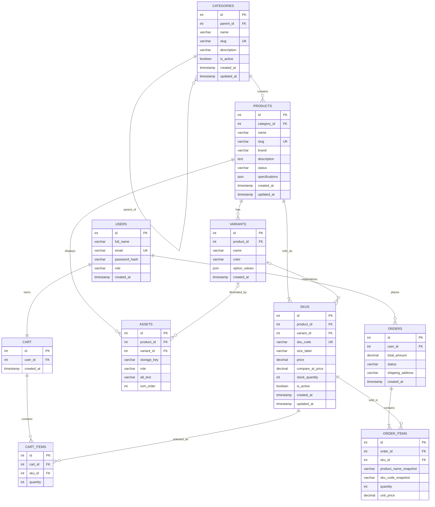

# Sprint 2: Catalog Data Foundation
## Project: SneakMart — Sneakers E-Commerce Platform

> **Status legend:** ✅ = design decided in this document. 🔲 = evidence to be pasted after running the code (marked `TODO-EVIDENCE`). No evidence section contains invented output.

---

## 1. Sprint Goal and Scope Boundary

**Goal:** An administrator can persist categories, products, variants, and SKUs without losing identity, relationship, price, or inventory meaning.

**In scope (Sprint 2)**
- Category tree (stable ids, unique slugs, optional parent, no cycles, deactivation)
- Product create/edit with status and description
- Variants (colorway) and SKUs (size-level sellable unit) with unique code, own price, own stock
- Authenticated, role-checked admin API (ASP.NET Core Web API, JWT)
- DB constraints, EF Core migrations, seed data, automated tests

**Out of scope (Sprint 3 or later)** — not claimed as Sprint 2 functionality
- Dynamic specification **values/validation logic** (only the column and the rule are designed here)
- Asset upload (only the `assets` table is created)
- Public catalog search/filter, publication workflow
- Payment gateway, order placement, shipping, shopper checkout

---

## 2. Link to Sprint 1 Decisions (Reused / Changed)

| Sprint 1 decision | Sprint 2 treatment | Why |
|---|---|---|
| Domain: sneakers only | **Reused** | Variants = colorway, SKU = size, which fits sneakers exactly |
| Stack: Angular + ASP.NET Core Web API + MySQL | **Reused** | No stack change |
| JWT + BCrypt, `Users.role` (`customer`/`admin`) | **Reused** | Admin routes require `role = admin` |
| MVP "Admin: Inventory Control" (Medium) | **Implemented** (catalog part) | Admin CRUD for catalog is this sprint's core |
| Redis caching | **Still deferred** | Not needed for Sprint 2 |
| `Products` held `size`, `color`, `price`, `stock_quantity` directly | **Changed** | A flat product row cannot represent one shoe in many sizes/colors with separate stock and price. These columns move to `variants` / `skus` |
| `Cart_Items.product_id → Products` | **Changed** → `sku_id → SKUs` | A cart must reference exactly what is bought (shoe + color + size) |
| `Order_Items.product_id → Products` | **Changed** → `sku_id → SKUs` + snapshot columns | Orders must survive later price/name changes |
| `Categories` flat (Running, Basketball, Lifestyle) | **Extended** with `parent_id`, `slug`, `is_active`, timestamps | Tree required by CAT01 |
| `Users`, `Orders`, `Cart` | **Unchanged** | Not part of this sprint |

---

## 3. Updated ERD and Data Dictionary

### 3.1 Cardinality summary

| Relationship | Cardinality | ON DELETE | ON UPDATE |
|---|---|---|---|
| Categories → Categories (parent) | 1 : 0..N | RESTRICT | RESTRICT |
| Categories → Products | 1 : 0..N | RESTRICT | RESTRICT |
| Products → Variants | 1 : 0..N | CASCADE | RESTRICT |
| Products → SKUs | 1 : 1..N (at least one before `active`) | CASCADE | RESTRICT |
| Variants → SKUs | 1 : 0..N (optional) | RESTRICT | RESTRICT |
| Products → Assets | 1 : 0..N | CASCADE | RESTRICT |
| Variants → Assets (optional) | 1 : 0..N | SET NULL | RESTRICT |
| Users → Cart | 1 : 1 | CASCADE | RESTRICT |
| Cart → Cart_Items | 1 : 0..N | CASCADE | RESTRICT |
| SKUs → Cart_Items | 1 : 0..N | CASCADE | RESTRICT |
| Users → Orders | 1 : 0..N | RESTRICT | RESTRICT |
| Orders → Order_Items | 1 : 1..N | CASCADE | RESTRICT |
| SKUs → Order_Items | 1 : 0..N | **RESTRICT** (sold SKUs can never be hard-deleted) | RESTRICT |

`ON UPDATE RESTRICT` everywhere: all keys are surrogate auto-increment ids and never change.

### 3.2 Mermaid ER diagram



### 3.3 Data dictionary (MySQL 8.0.16+, InnoDB, utf8mb4)

**categories**

| Column | Type | Constraints |
|---|---|---|
| id | INT | PK, AUTO_INCREMENT |
| parent_id | INT | NULL, FK → categories.id (RESTRICT), `CHECK (parent_id <> id)` |
| name | VARCHAR(50) | NOT NULL |
| slug | VARCHAR(80) | NOT NULL, **UNIQUE** |
| description | VARCHAR(255) | NULL |
| is_active | BOOLEAN | NOT NULL DEFAULT TRUE |
| created_at / updated_at | DATETIME(6), UTC | NOT NULL, defaults |

**products**

| Column | Type | Constraints |
|---|---|---|
| id | INT | PK, AUTO_INCREMENT |
| category_id | INT | NOT NULL, FK → categories.id (RESTRICT) |
| name | VARCHAR(150) | NOT NULL |
| slug | VARCHAR(180) | NOT NULL, **UNIQUE** |
| brand | VARCHAR(50) | NOT NULL (kept from Sprint 1) |
| description | TEXT | NULL |
| status | VARCHAR(20) | NOT NULL DEFAULT `'draft'`, `CHECK (status IN ('draft','active','archived'))` |
| specifications | JSON | NULL (see 3.4) |
| created_at / updated_at | DATETIME(6), UTC | NOT NULL |

**variants** (one colorway of a product)

| Column | Type | Constraints |
|---|---|---|
| id | INT | PK, AUTO_INCREMENT |
| product_id | INT | NOT NULL, FK → products.id (CASCADE) |
| name | VARCHAR(80) | NOT NULL (e.g. "Black/White") |
| color | VARCHAR(40) | NOT NULL |
| option_values | JSON | NULL (extra options, e.g. `{"width":"wide"}`) |
| created_at | DATETIME(6), UTC | NOT NULL |
| — | — | **UNIQUE (product_id, name)**, **UNIQUE (id, product_id)** (target for composite FK) |

**skus** (the sellable unit: shoe + colorway + size)

| Column | Type | Constraints |
|---|---|---|
| id | INT | PK, AUTO_INCREMENT |
| product_id | INT | NOT NULL, FK → products.id (CASCADE) |
| variant_id | INT | NULL (NULL = product has no variants) |
| sku_code | VARCHAR(40) | NOT NULL, **UNIQUE** |
| size_label | VARCHAR(10) | NOT NULL (e.g. "US 10") |
| price | DECIMAL(10,2) | NOT NULL, `CHECK (price >= 0)` |
| compare_at_price | DECIMAL(10,2) | NULL, `CHECK (compare_at_price IS NULL OR compare_at_price >= price)` (display only) |
| stock_quantity | INT | NOT NULL DEFAULT 0, **`CHECK (stock_quantity >= 0)`** |
| is_active | BOOLEAN | NOT NULL DEFAULT TRUE |
| variant_key | INT | STORED GENERATED `IFNULL(variant_id, 0)` |
| created_at / updated_at | DATETIME(6), UTC | NOT NULL |
| — | — | **Composite FK (variant_id, product_id) → variants(id, product_id)**: a SKU cannot point to a variant of a *different* product |
| — | — | **UNIQUE (product_id, variant_key, size_label)**: the same size cannot exist twice for the same shoe/colorway, including the no-variant case |

**assets** (table only; upload is Sprint 3)

| Column | Type | Constraints |
|---|---|---|
| id | INT | PK |
| product_id | INT | NOT NULL, FK → products.id (CASCADE) |
| variant_id | INT | NULL, FK → variants.id (SET NULL) |
| storage_key | VARCHAR(255) | NOT NULL |
| role | VARCHAR(20) | NOT NULL (`primary`, `gallery`, `thumbnail`) |
| alt_text | VARCHAR(255) | NULL |
| sort_order | INT | NOT NULL DEFAULT 0 |

**cart_items** — `product_id` replaced by `sku_id INT NOT NULL FK → skus.id (CASCADE)`; `UNIQUE (cart_id, sku_id)`; `CHECK (quantity > 0)`.

**order_items** — `product_id` replaced by `sku_id INT NOT NULL FK → skus.id (RESTRICT)`; adds `product_name_snapshot VARCHAR(150)`, `sku_code_snapshot VARCHAR(40)`; `unit_price` DECIMAL(10,2) is the price at purchase time; `CHECK (quantity > 0)`.

### 3.4 Specification decision and validation rule

Sprint 1 did not pick between JSON and EAV, so Sprint 2 chooses **validated JSON on `products.specifications`** (MySQL `JSON` type, the equivalent of PostgreSQL JSONB). Reason: sneaker specs (upper material, drop, weight, closure) are display attributes, not heavily filtered in the MVP; one column is simpler than three EAV tables.

**Validation rule (enforced by the API in Sprint 3, DB guards structure now):**
1. Value must be a JSON **object** (`CHECK (specifications IS NULL OR JSON_TYPE(specifications) = 'OBJECT')`).
2. Keys: lowercase `snake_case`, max 40 chars, max 20 keys.
3. Values: string (≤ 200 chars), number, or boolean only. No nested objects or arrays.

### 3.5 Money and stock

- Money = `DECIMAL(10,2)`. No FLOAT/DOUBLE anywhere; C# uses `decimal`.
- Stock cannot go negative: DB `CHECK (stock_quantity >= 0)` **plus** API validation (`stock_quantity >= 0` on create; adjustments that would result in < 0 return `422`).

---

## 4. Administration Route Table

Base path: `/api/v1/admin`. ASP.NET Core uses `{id}` instead of `:id`. All routes require `Authorization: Bearer <JWT>` with claim `role=admin`.

| Method | Route | Purpose | Success | Errors |
|---|---|---|---|---|
| POST | `/categories` | Create category | 201 | 400, 401, 403, 404 (parent), 409 (slug), 422 |
| GET | `/categories` | Category tree (nested) | 200 | 401, 403 |
| PATCH | `/categories/{id}` | Rename, re-parent, activate/deactivate | 200 | 400, 401, 403, 404, 409, 422 (cycle) |
| POST | `/products` | Create **draft** product | 201 | 400, 401, 403, 404 (category), 409 (slug), 422 |
| GET | `/products` | List products (paging: `page`, `pageSize`, filter `status`) | 200 | 401, 403 |
| GET | `/products/{id}` | Product with variants and SKUs | 200 | 401, 403, 404 |
| PATCH | `/products/{id}` | Update content or status | 200 | 400, 401, 403, 404, 409, 422 |
| POST | `/products/{id}/variants` | Add variant | 201 | 400, 401, 403, 404, 409, 422 |
| POST | `/products/{id}/skus` | Add SKU | 201 | 400, 401, 403, 404, 409 (sku_code / size), 422 |
| PATCH | `/skus/{id}` | Update price, stock, active | 200 | 400, 401, 403, 404, 422 |

> Mark the final list against the actual controllers before submission.

### Consistent error response (all 4xx)

```json
{
  "status": 409,
  "code": "DUPLICATE_SKU_CODE",
  "message": "A SKU with this code already exists.",
  "errors": [ { "field": "skuCode", "message": "PEG41-BW-42 is already in use." } ]
}
```

Codes used: `VALIDATION_ERROR` (400/422), `UNAUTHENTICATED` (401), `FORBIDDEN` (403), `NOT_FOUND` (404), `DUPLICATE_SLUG` / `DUPLICATE_SKU_CODE` / `DUPLICATE_SKU_COMBINATION` (409), `CATEGORY_CYCLE` / `NEGATIVE_STOCK` / `PRODUCT_HAS_NO_ACTIVE_SKU` (422). A global exception handler converts DB unique-violation errors (MySQL error 1062) to the 409 form, so no stack trace is ever returned.

### Endpoint documentation with examples

#### POST `/api/v1/admin/categories`
- **Request:** `name` (string, required, ≤50), `slug` (string, required, unique, `^[a-z0-9]+(-[a-z0-9]+)*$`), `parentId` (int, optional), `description` (optional)
- **Response 201:** `{ id, parentId, name, slug, isActive, createdAt }`

```http
POST /api/v1/admin/categories
Authorization: Bearer <REDACTED>
Content-Type: application/json

{ "name": "Running", "slug": "running", "parentId": 1 }
```
```json
{ "id": 2, "parentId": 1, "name": "Running", "slug": "running", "isActive": true, "createdAt": "2026-10-05T09:00:00Z" }
```

#### GET `/api/v1/admin/categories`
- **Response 200:** nested tree `[ { id, name, slug, isActive, children: [ ... ] } ]`

#### PATCH `/api/v1/admin/categories/{id}`
- **Request (any subset):** `name`, `slug`, `description`, `parentId`, `makeRoot` (`true` moves the category to the root), `isActive`
- **422 `CATEGORY_CYCLE`:** new parent equals the category itself or one of its descendants

#### POST `/api/v1/admin/products`
- **Request:** `categoryId` (required), `name` (required, ≤150), `slug` (required, unique), `brand` (required), `description` (optional)
- **Response 201:** product with `status: "draft"` and empty `variants`/`skus` arrays

```http
POST /api/v1/admin/products
{ "categoryId": 2, "name": "Nike Air Zoom Pegasus 41", "slug": "nike-air-zoom-pegasus-41", "brand": "Nike" }
```
```json
{ "id": 1, "categoryId": 2, "name": "Nike Air Zoom Pegasus 41", "slug": "nike-air-zoom-pegasus-41",
  "brand": "Nike", "status": "draft", "variants": [], "skus": [] }
```

#### GET `/api/v1/admin/products`
- **Query:** `page` (default 1), `pageSize` (default 20, max 100), `status`
- **Response 200:** `{ items: [ ... ], page, pageSize, total }`

#### PATCH `/api/v1/admin/products/{id}`
- **Request (any subset):** `name`, `slug`, `description`, `brand`, `categoryId`, `status`
- **422 `PRODUCT_HAS_NO_ACTIVE_SKU`:** setting `status = active` with no active SKU

#### POST `/api/v1/admin/products/{id}/variants`
- **Request:** `name` (required), `color` (required), `optionValues` (optional object)
- **409** if `(product, name)` already exists

#### POST `/api/v1/admin/products/{id}/skus`
- **Request:** `skuCode` (required, ≤40, unique), `variantId` (optional, must belong to this product), `sizeLabel` (required), `price` (required, ≥ 0, 2 decimals), `compareAtPrice` (optional), `stockQuantity` (required, ≥ 0)
- **Response 201:** `{ id, productId, variantId, skuCode, sizeLabel, price, stockQuantity, isActive }`
- **409:** duplicate `skuCode` or duplicate (variant, size). **422:** `variantId` belongs to another product, or negative stock/price

```json
{ "skuCode": "PEG41-BW-42", "variantId": 1, "sizeLabel": "US 9", "price": 129.99, "stockQuantity": 10 }
```

#### PATCH `/api/v1/admin/skus/{id}`
- **Request (any subset):** `price`, `compareAtPrice`, `stockQuantity` (absolute value) or `stockDelta` (adjustment), `isActive`
- **422 `NEGATIVE_STOCK`:** result would be below 0. `skuCode` is immutable after creation.

---

## 5. Data Integrity and Authorization Decisions

### Integrity (database-level, not only API)
| Rule | Mechanism |
|---|---|
| Unique category slug, product slug, SKU code | `UNIQUE` indexes |
| No duplicate size per shoe/colorway | `UNIQUE (product_id, variant_key, size_label)` |
| SKU's variant belongs to the same product | Composite FK `(variant_id, product_id)` |
| No negative stock / price | `CHECK` constraints |
| Valid status | `CHECK (status IN ...)` |
| Category cannot be its own parent | `CHECK (parent_id <> id)` |
| Category cannot become its own **ancestor** (deeper cycles) | **Service layer** walks ancestors inside a transaction; MySQL cannot express this as a constraint. Covered by test |
| Sold SKUs never disappear | `order_items.sku_id` FK `RESTRICT` |

### Authorization
- Login (Sprint 1) issues JWT containing `sub` and `role`.
- Admin controllers use `[Authorize(Roles = "admin")]`.
- No token → **401**; valid token with `customer` role → **403**. Tested for every admin route group.
- Secrets (JWT key, DB password) come from environment variables / user-secrets, never committed.

### Business-rule answers (required by the manual)

1. **Draft product without SKU? Published without sellable SKU?** A draft may have no SKU (admin is still building it). A product cannot become `active` unless it has at least one SKU with `is_active = true`. If its last active SKU is later deactivated, the product is automatically moved back to `draft`.
2. **Canonical category or many?** One canonical category (`products.category_id`). It avoids duplicate URLs/breadcrumbs and keeps the MVP simple. Many-to-many (e.g. "Sale", "New Arrivals") is a Sprint 3+ addition via a `product_categories` join table, without breaking this model.
3. **Parent category deactivated?** All descendants are deactivated in the same transaction. Products stay assigned to their category but are hidden from public reads while the category is inactive. Reactivating a parent does **not** auto-reactivate children (explicit admin action).
4. **Out-of-stock SKU in a public response?** The SKU is still returned with `inStock: false` (size shown greyed out); exact `stockQuantity` is not exposed publicly. A SKU whose `is_active = false` or a combination that does not exist is **not returned**.
5. **Same price / price override?** Two SKUs may share a price. There is no product-level base price, so no override concept: each SKU owns its price. `compare_at_price` is optional and display-only (strike-through "was" price).
6. **What prevents negative stock and duplicate SKU codes?** `CHECK (stock_quantity >= 0)` and `UNIQUE (sku_code)` in the database, plus API validation that returns 422/409 before the DB error.
7. **Deactivated product referenced by a cart/order?** Orders keep working: `order_items` stores `sku_id` (RESTRICT delete) plus name/code/price snapshots. Cart items are not silently deleted; they are flagged unavailable and blocked at checkout (Sprint 3+). Hard delete is only allowed for products never sold; otherwise status `archived`.

### Variant/SKU modelling decision (CAT03/CAT04)
- **Variant** = colorway. **SKU** = a specific size of a variant.
- A combination that is not manufactured (e.g. Pegasus 41 *Volt/Blue* in US 10) has **no row**. It is never stored as a fake zero-stock SKU.
- "Out of stock" (row exists, stock 0) and "does not exist" (no row) are therefore different and distinguishable.

---

## 6. Seed Data and Demonstration

### Schema and migrations

- EF Core model: `src/SneakMart.Api/Data/AppDbContext.cs` (all constraints in 3.3 are declared there).
- Migration: generated with `dotnet ef migrations add InitialCatalog` (commands in README section `README_SPRINT2_SECTION.md`).
- Plain-SQL equivalent for review: `db/001_catalog_schema.sql`.

### Seed content (`dotnet run --project src/SneakMart.Api -- --seed`, idempotent: truncates catalog tables then re-inserts)

**Category tree (2 levels)**
```
Footwear (footwear)
├── Running (running)
├── Basketball (basketball)
└── Lifestyle (lifestyle)
```

**Products, variants, SKUs**

| Product | Category | Variant | SKU code | Size | Price | Stock |
|---|---|---|---|---|---|---|
| Nike Air Zoom Pegasus 41 | Running | Black/White | PEG41-BW-9 | US 9 | 129.99 | 10 |
| | | Black/White | PEG41-BW-10 | US 10 | 129.99 | 8 |
| | | Volt/Blue | PEG41-VB-9 | US 9 | 134.99 | 5 |
| | | Volt/Blue | *(US 10 intentionally missing: not produced → no row)* | | | |
| Air Jordan 1 Retro High OG | Basketball | Chicago | AJ1-CHI-9 | US 9 | 179.99 | **0** (out of stock) |
| | | Chicago | AJ1-CHI-11 | US 11 | 179.99 | 3 |
| Adidas Samba OG | Lifestyle | *(none: zero-variant product)* | SAMBA-OG-9 | US 9 | 99.99 | 12 |

Covers: 2-level tree ✔, 3 products ✔, 6 SKUs ✔, a product with multiple variants ✔, an intentionally unavailable combination ✔, an out-of-stock SKU ✔, a zero-variant product ✔. An admin user is also seeded (`admin@sneakmart.local`, password from environment variable `SEED_ADMIN_PASSWORD`).

### Demonstration script (admin creates category → product → variant → SKU → reads back)

1. `POST /api/v1/auth/login` as admin → copy token (redacted below)
2. `POST /api/v1/admin/categories`
3. `POST /api/v1/admin/products`
4. `POST /api/v1/admin/products/{id}/variants`
5. `POST /api/v1/admin/products/{id}/skus`
6. `GET /api/v1/admin/products/{id}` and `GET /api/v1/admin/categories`

> **TODO-EVIDENCE:** paste real request/response pairs here (token and private URLs replaced by `<REDACTED>`).

```
[ paste captured Postman/curl output ]
```

---

## 7. Test Strategy, Command, and Result

**Framework:** xUnit + `WebApplicationFactory` (integration) + Testcontainers MySQL, so DB constraints are tested on real MySQL and not on a fake in-memory provider. Docker must be running. Test files: `CategoryTests`, `ProductTests`, `SkuTests`, `AuthorizationTests`, `SeedTests` in `tests/SneakMart.Tests/`.

| Area | Test (success ✔ / rejection ✘) |
|---|---|
| Product | ✔ create with required fields → 201 draft; ✘ missing name → 400 |
| SKU | ✔ create with valid price/stock → 201; ✘ negative price/stock → 422 |
| Duplicate slug | ✘ category slug twice → 409; ✘ product slug twice → 409 |
| Duplicate SKU | ✘ same `skuCode` twice → 409; ✘ same (variant, size) twice → 409 |
| Category hierarchy | ✔ 2-level tree; ✘ self-parent → 422; ✘ A→B→C then set A's parent = C → 422 (cycle) |
| Deactivation | ✔ deactivating parent deactivates descendants |
| Variants/SKUs | ✘ SKU with variant of another product → 422 (DB composite FK also verified); ✔ missing combination creates no row |
| Stock | ✘ `stockDelta` that makes stock < 0 → 422; direct DB update to −1 fails on CHECK |
| Publication rule | ✘ set `active` with no active SKU → 422 |
| Authorization | ✘ no token → 401; ✘ customer token → 403 on every admin route; ✔ admin token → 2xx |
| Seed | ✔ seed on clean DB yields 3 products / 6 SKUs / 2 category levels |

**Command**
```bash
dotnet test tests/SneakMart.Tests
```

> **TODO-EVIDENCE:** paste final output, e.g. `Passed! - Failed: 0, Passed: NN, Skipped: 0`.

---

## 8. Known Limitations and Sprint 3 Backlog

**Known limitations**
- Cycle prevention is enforced in application code (transactional), not by a DB constraint.
- Specifications column exists, but its validator is not active yet.
- `assets` table exists with no upload endpoint.
- Public catalog endpoints do not exist; only admin reads.
- Variants are colorway only; multi-axis options live in the `option_values` JSON.
- `AuthController` is a minimal login added so Sprint 2 runs on its own; it can be replaced by the Sprint 1 auth (JWT needs only `sub` and `role` claims).
- `stockDelta` is a read-modify-write; concurrent adjustments could lose an update (stock still never goes negative because of the DB `CHECK`). Row versioning is a Sprint 3+ item.

**Sprint 3 backlog (builds on these tables; must reuse SKU identities and pricing, not duplicate them)**
1. Specification validation (JSON rules in 3.4) and admin editing
2. Asset upload/storage and primary-image rules
3. Public catalog reads: list, detail, filter by brand/size/category/price, search
4. Publication rules and visibility (inactive category/product/SKU filtering)
5. Catalog-to-cart readiness: `cart_items.sku_id`, stock check on add-to-cart, unavailable-item flagging
6. Optional many-to-many categories/tags
