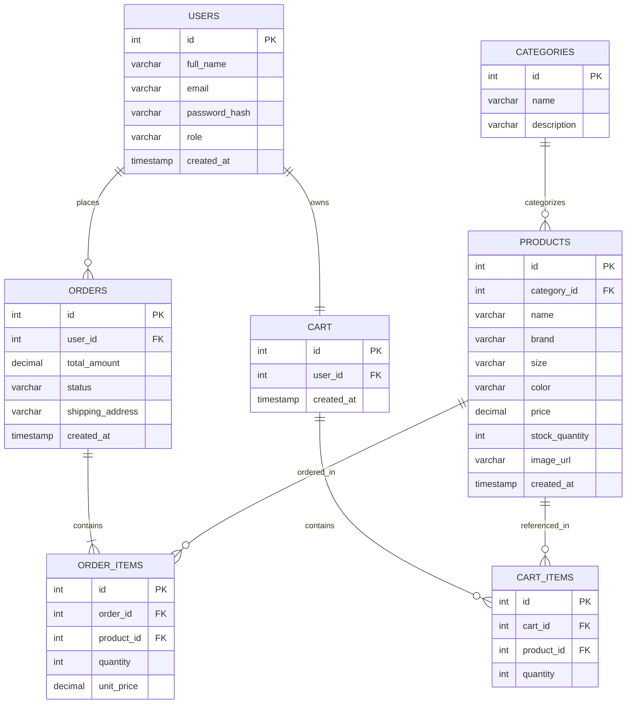

# Sprint 1: System Architecture & Scope Definition
## Project: SneakMart — Sneakers E-Commerce Platform

## Section 1: Target Audience & Market Focus

**Primary Persona:**
Young, style-conscious retail consumers (ages 16–35) who are sneaker enthusiasts, collectors, and everyday buyers looking to purchase both mainstream and limited-edition sneakers online. Secondary persona includes casual shoppers looking for everyday footwear across multiple brands.

**Core Pain Point:**
Sneaker buyers struggle to find a single trustworthy platform that offers accurate size/stock availability, verified product authenticity, and a fast, reliable checkout experience. Many existing marketplaces are cluttered, slow, or lack real-time inventory accuracy — leading to canceled orders and poor user trust.

**Domain Scope:**
Vertical Market: **Footwear / Sneakers** (a specialized sub-vertical of Apparel & Accessories). The platform focuses exclusively on sneakers — including performance, casual, and limited-edition/collector releases — rather than general apparel.

## Section 2: Minimum Viable Product (MVP) Feature Scope

| Category | Feature Name | Description | Priority |
|---|---|---|---|
| Authentication | User Registration & Authentication | Secure sign-up/login with password hashing (BCrypt) and JWT-based session authentication. | High (MVP) |
| Catalog | Product List & Search | Sneaker browsing interface with filtering by brand, size, category, and price range. | High (MVP) |
| Cart | Cart Management | Persistent cart state (add, update quantity, remove items) tied to the logged-in user. | High (MVP) |
| Checkout | Order Processing | Mock/Stripe payment gateway integration, order object instantiation, and order confirmation. | High (MVP) |
| Admin | Inventory Control | Admin CRUD operations for managing sneaker listings, stock quantity, and categories. | Medium |
| Account | Order History | Users can view their past orders and order status. | Medium |

## Section 3: Tech Stack Selection & Justification

### Frontend Framework: **HTML, CSS, Angular**
**Justification:** Angular's component-based architecture and built-in TypeScript support make it well-suited for a catalog-heavy application with multiple interactive views (product listing, filters, cart, checkout). Its native two-way data binding and RxJS-based state handling simplify managing cart state and real-time UI updates, compared to manually wiring vanilla JS or lighter libraries. HTML/CSS handle semantic structure and custom styling for product cards and layout.

### Backend Infrastructure: **ASP.NET (Core Web API)**
**Justification:** ASP.NET Core offers strong built-in support for JWT authentication, dependency injection, and Entity Framework Core, which accelerates building secure REST APIs for authentication, catalog, and order services. Its performance and scalability are well-proven for e-commerce workloads, and its ecosystem integrates cleanly with MySQL via EF Core providers, compared to lighter frameworks like Express which require more manual setup for the same guarantees.

### Database Management System: **MySQL**
**Justification:** The sneaker store's data is inherently relational — users, orders, products, and categories all have strict foreign-key relationships and require transactional integrity (e.g., stock deduction on checkout). MySQL provides mature ACID-compliant transactions, strong relational constraint enforcement, and wide hosting/tooling support, making it preferable over a non-relational option like MongoDB for this schema.

### Caching & Asynchronous Processing (Optional):
Not implemented in the MVP scope. Future scope may introduce **Redis** for caching frequently-browsed product catalog queries and session data to reduce database load as traffic scales.

## Section 4: Entity-Relationship Diagram (ERD)

### Keys, Cardinality & Relationships
- **Users (1) — (N) Orders**: One user can place many orders.
- **Users (1) — (1) Cart**: Each user has exactly one active cart.
- **Cart (1) — (N) Cart_Items**: One cart contains many cart items.
- **Products (1) — (N) Cart_Items**: One product can appear in many carts.
- **Orders (1) — (N) Order_Items**: One order contains many order line items.
- **Products (1) — (N) Order_Items**: One product can be ordered in many order items.
- **Categories (1) — (N) Products**: One category groups many products (e.g., Running, Basketball, Lifestyle).

### Mermaid ERD

### Attribute Data Types (MySQL)

| Entity | Attribute | Type |
|---|---|---|
| Users | id | INT, PK, AUTO_INCREMENT |
| Users | full_name | VARCHAR(100) |
| Users | email | VARCHAR(150), UNIQUE |
| Users | password_hash | VARCHAR(255) |
| Users | role | VARCHAR(20) (e.g., 'customer', 'admin') |
| Users | created_at | TIMESTAMP |
| Categories | id | INT, PK, AUTO_INCREMENT |
| Categories | name | VARCHAR(50) |
| Products | id | INT, PK, AUTO_INCREMENT |
| Products | category_id | INT, FK → Categories.id |
| Products | brand | VARCHAR(50) |
| Products | size | VARCHAR(10) |
| Products | price | DECIMAL(10,2) |
| Products | stock_quantity | INT |
| Cart | id | INT, PK, AUTO_INCREMENT |
| Cart | user_id | INT, FK → Users.id |
| Cart_Items | id | INT, PK, AUTO_INCREMENT |
| Cart_Items | cart_id | INT, FK → Cart.id |
| Cart_Items | product_id | INT, FK → Products.id |
| Cart_Items | quantity | INT |
| Orders | id | INT, PK, AUTO_INCREMENT |
| Orders | user_id | INT, FK → Users.id |
| Orders | total_amount | DECIMAL(10,2) |
| Orders | status | VARCHAR(20) |
| Order_Items | id | INT, PK, AUTO_INCREMENT |
| Order_Items | order_id | INT, FK → Orders.id |
| Order_Items | product_id | INT, FK → Products.id |
| Order_Items | quantity | INT |
| Order_Items | unit_price | DECIMAL(10,2) |
